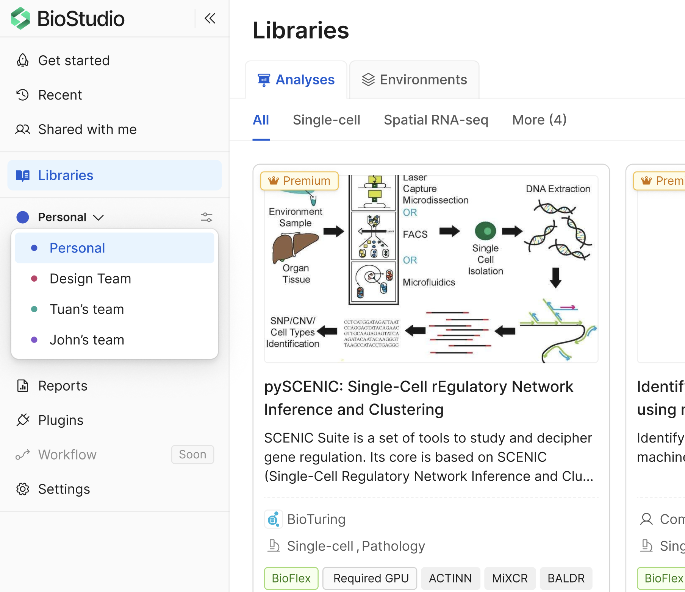
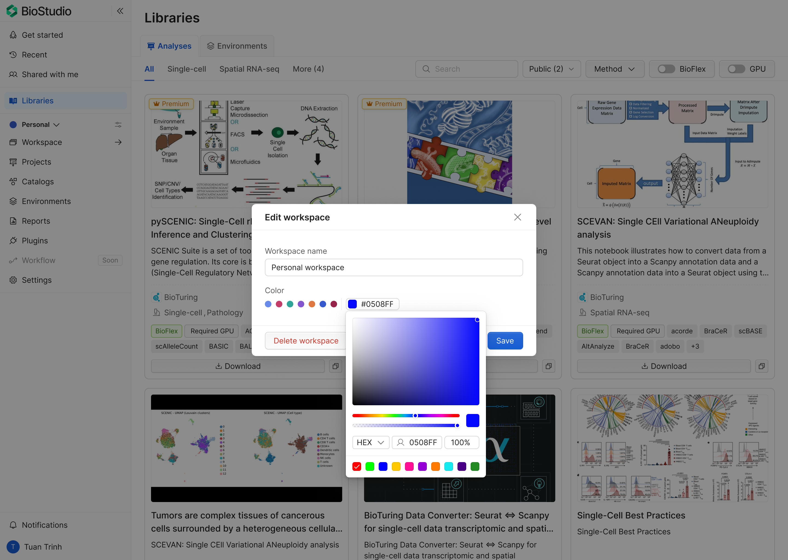

# Workspace access and permissions

Workspace actions are controlled by permissions.
A user can perform an action only when the required permission is granted.

Users with the workspace delete permission can permanently delete the workspace.

## Before you start

- Make sure you are in the correct workspace (default is Personal workspace).
- Confirm your current role (member/admin or equivalent).
- Ask an admin to grant permissions before attempting restricted actions.

## Switch workspace

Use **Switch workspace** to move between your Personal workspace and team workspaces.
After switching, all pages and actions run in the selected workspace context.

1. In the left sidebar, find the current workspace section.
2. Click the workspace dropdown.
3. Select the target workspace (for example: `Personal`, `Group A`, `Group B`).
4. Wait for the page to reload in the new workspace context.

Result:
- The selected workspace becomes active.
- Libraries, files, members, and settings reflect the selected workspace.

Permission behavior after switching:
- If permission is granted in the selected workspace, the action is available.
- If permission is not granted, depending on the contexts. The action is hidden, disabled, or blocked.

## Edit workspace information

1. Open the workspace page.
2. Click the workspace settings action.
3. In the **Edit workspace information** modal, update allowed fields.
4. Save changes.

Expected behavior:
- Only users with **edit workspace permission** can complete this action.
- The users don't have the permission, the action is disabled with tooltip explanation while hovering.

## Delete a workspace

Deleting a workspace is a destructive action.
It removes workspace resources and cannot be undone.

1. Open workspace settings.
2. Select **Delete workspace**.
3. Confirm the deletion in the warning dialog.

Expected behavior:
- Only users with **delete-workspace permission** can complete this action.
- The users don't have the permission, the action is disabled with tooltip explanation while hovering.

Recommended warning text:

> This will permanently delete the workspace and all its data. This action cannot be undone.

## Manage workspace members and access

This section is documented separately in `03. Members.md`.
Use that guide for inviting/removing members, role updates, and permission handling.

## Permission behavior reference

Apply the same rule to every workspace action:

- permission granted: action is available,
- permission missing: action is hidden, disabled, or blocked with clear feedback.

## Next steps

- Define a permission matrix by action (view, edit, manage members, delete).
- Align UI states for unauthorized actions across all workspace screens.
- Document admin approval flow for permission requests.

#bioturing #biostudio #workspace #permission
