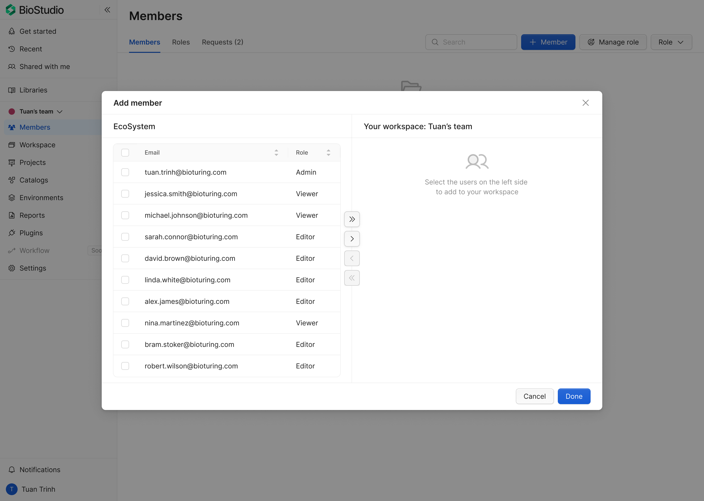
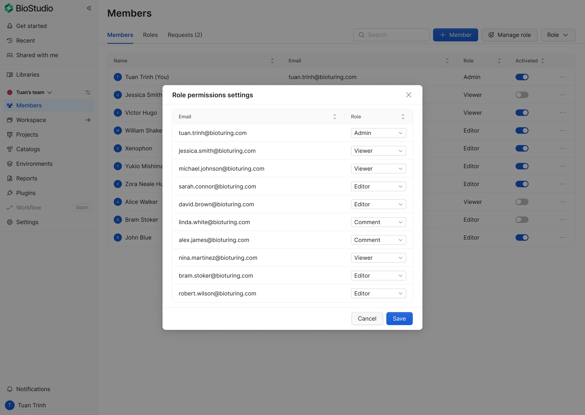
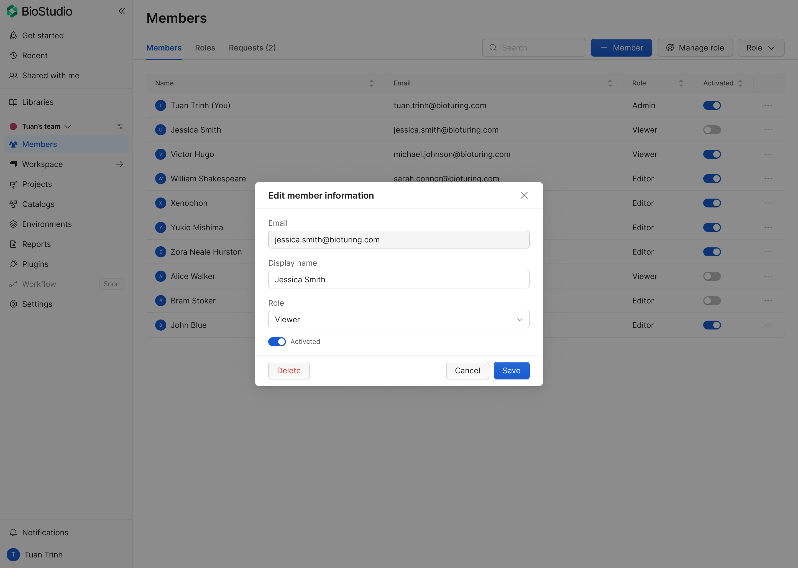
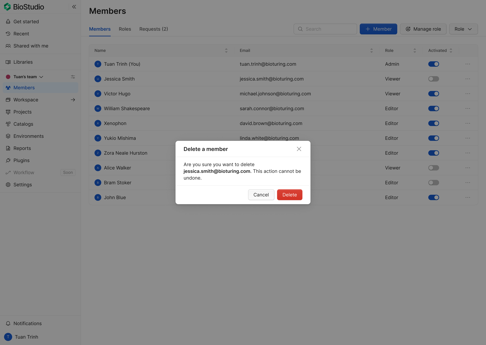
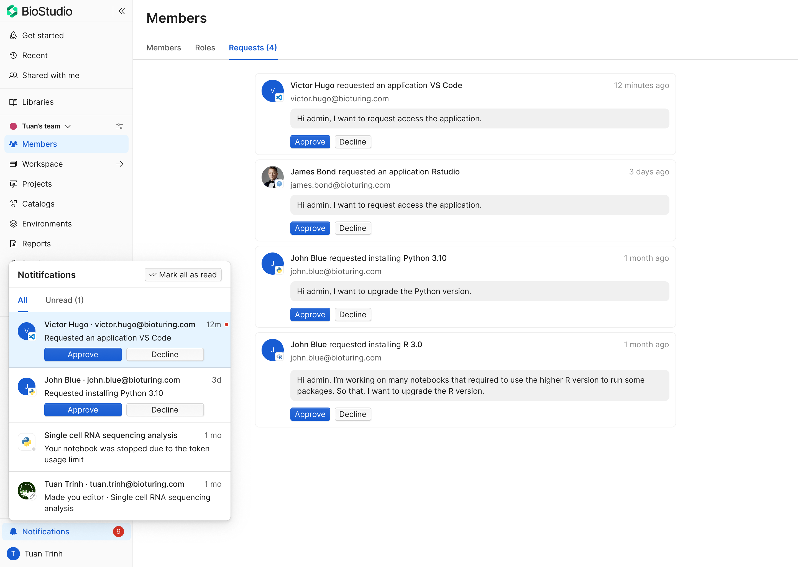

# Members

Use the **Members** feature to add users, manage roles, edit member profile fields, and remove members.
All actions are permission-gated.

## Before you start

- Open the target workspace (default is Personal workspace).
- Click **Members** in the left sidebar.
- Ensure your account has member-management permission.

If permission is missing, actions are hidden, disabled, or blocked.

## Add member (From EcoSystem)

This flow adds users from EcoSystem into the current workspace.

1. Open **Members**.
2. Click **+ Member**.
3. In the modal, review two panels:
- **EcoSystem** (source users)
- **Your workspace** (destination members)
4. Select one or more users in the EcoSystem panel.
5. Move selected users to the destination panel.
6. Confirm to add members.

Expected behavior:
- Added users appear in the Members table.
- Success message is shown.
- If no eligible user is selected, confirm action stays unavailable.

## Manage role

This flow updates roles for one or multiple members.
1. Open **Members**.
2. Click **Manage role**.
3. In **Role permissions settings**, review user list and role column.
4. Change role per user (for example: Viewer, Editor, Admin, Comment).
5. Click **Save**.

Expected behavior:
- Role updates are applied immediately after save.
- Unauthorized users cannot open or save role settings.

## Edit member information

This flow updates a specific member profile in the workspace.

1. Open **Members**.
2. On target row, open **More** menu.
3. Select **Edit**.
4. In **Edit member information**, update available fields (for example email, display name, role, activated state).
5. Click **Save**.

Expected behavior:
- Success message is shown.
- Updated data appears in the member row.
- If user lacks permission, edit action is not available.

## Delete a member

This flow removes a member from the current workspace.

1. Open **Members**.
2. On target row, open **More** menu.
3. Select **Delete**.
4. Confirm in the **Delete a member** dialog.

Expected behavior:
- Member is removed from workspace list.
- Destructive warning is shown before final confirmation.

Recommended warning copy:

> Are you sure you want to delete this member? This action cannot be undone.

## Request management (Admin only)

The **Requests** tab is used by administrators to review and resolve access or resource requests from members.

Typical requests include:
- application access requests (for example VS Code, RStudio),
- runtime/environment upgrade requests (for example Python/R version),
- other permission-related approvals.

### Open and review requests

1. Open **Members**.
2. Go to **Requests** tab.
3. Review each request card:
- requester name and email,
- requested item/action,
- requester message/reason,
- request age/timestamp.

### Decide a request

1. Open the target request.
2. Choose **Approve** or **Decline**.
3. Confirm action if confirmation is required.

Expected behavior:
- **Approve** grants the requested access/change in the current workspace scope.
- **Decline** closes the request without granting access.
- The request is removed from pending list after decision.

### Notifications integration

Requests are also surfaced in **Notifications** with quick actions.

- Admin can approve/decline directly from notification items.
- **Mark all as read** changes read state only; it does not approve or decline requests.
- Request counters (for example `Requests (4)`) reflect unresolved pending items.

### Admin control rules

- This feature is for administrators only.
- Non-admin users cannot approve or decline requests.
- If permission is missing, request actions must be hidden or disabled.

### Decision guidance

- Approve only when request is valid for the user’s role and project scope.
- Decline with clear reason when request is out of policy.
- Prioritize time-sensitive requests that block ongoing work.

### Audit and traceability

For each handled request, keep:
- decision (`approved`/`declined`),
- actor (admin who decided),
- timestamp,
- requested target (app/version/permission),
- optional decision note.

## Permission behavior reference

Apply this rule to all Members actions:

- permission granted: action is available,
- permission missing: action is hidden, disabled, or blocked with clear feedback.

This should be consistent across add, role management, edit, and delete flows.

## Operational recommendations

- Use least-privilege role assignment.
- Review Admin-level access periodically.
- Audit role changes and member removals.
- Show explicit success/failure feedback for all mutations.

#bioturing #biostudio #members #workspace #permission
