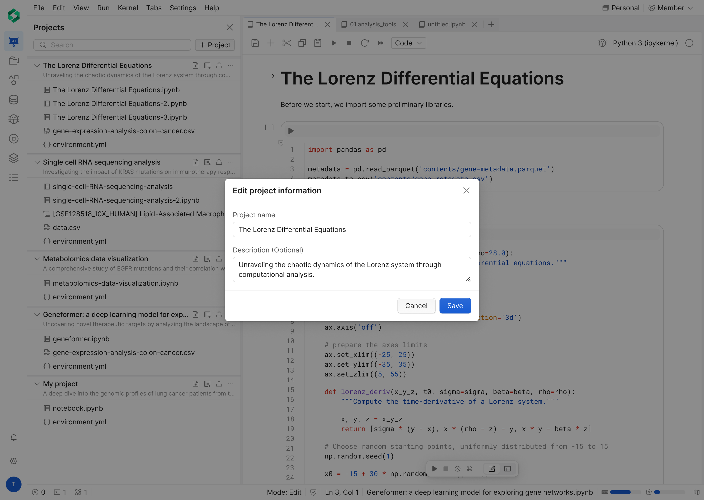

# Projects

Use the **Projects** feature to organize, store your work items (notebooks, data files, other related files) inside a workspace.
All actions are permission-gated.

## Before you start

- Open the target workspace.
- Click **Projects** in the left sidebar.
- Ensure your account has the required project permissions.

If permission is missing, actions are hidden, disabled, or blocked.

## Create project

Use this flow to create a new project in the current workspace.
1. There are 2 entry points to open **Projects**.
	1. Dashboard
	2. Workspace 
2. Click **+ Project**.
3. In **Create project** modal, enter the project name, and description.
4. Click **Create**.

Expected behavior:
- New project appears in the project list.
- Success feedback is shown.
- If required input is empty, create action stays unavailable.
- If create permission is missing, **+ Project** action is disabled.

## Manage project

### Edit project

Use this flow to rename or update editable project information.
1. Open **Projects**.
2. On target row, click **More**.
	1. Dashboard
	2. Workspace
3. Select **Rename** (or edit action).
4. In **Rename project name** or **Description** modal, update the project name.
5. Click **Save**.

Expected behavior:
- Updated name appears immediately in the list.
- Validation prevents invalid or empty values.
- If edit permission is missing, rename/edit action is not available.

### Delete project

Deleting a project is a destructive action.

1. Open **Projects**.
2. On target row, click **More**.
	1. Dashboard
	2. Workspace
3. Select **Delete project**.
4. In **Delete this project and its data?** dialog, review the warning and deletion scope.
5. In the confirmation input, type the exact project name shown in the dialog.
6. Click **Delete project**.

Expected behavior:
- Project is permanently removed from the workspace list.
- All files in the project are deleted.
- Original files in the File Browser are also deleted.
- Collaborators lose access to the deleted project.
- The **Delete project** button stays disabled until the typed name exactly matches.
- If delete permission is missing, delete action is not available.

Recommended warning copy:

> This will permanently delete the project and all associated files. This action cannot be undone. Collaborators will lose access.

#bioturing #biostudio #projects #workspace #permission
